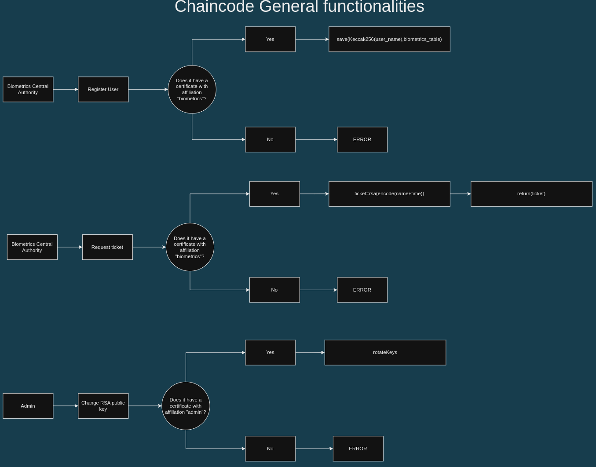

# INFO
- This is a simple chaincode as a service program
## Functionalities that should be on the chaincode itself
- Should register users when there is a affiliation "biometrics"
- Should return a biometrics table for a "biometrics" given user user
- Should create tickets when there is a affiliation "biometrics" that requests a ticket for a given user (that got authenticated) with a rounded time
## Functionalities that are out of the chaincode but in a service inner the chaincode in a grpc service
- Should be capable of rotating the RSA public key
## Functional requirements
- We should have the username encrypted
- We will be using keccak256, a SHA-3 algorithm just for fun

